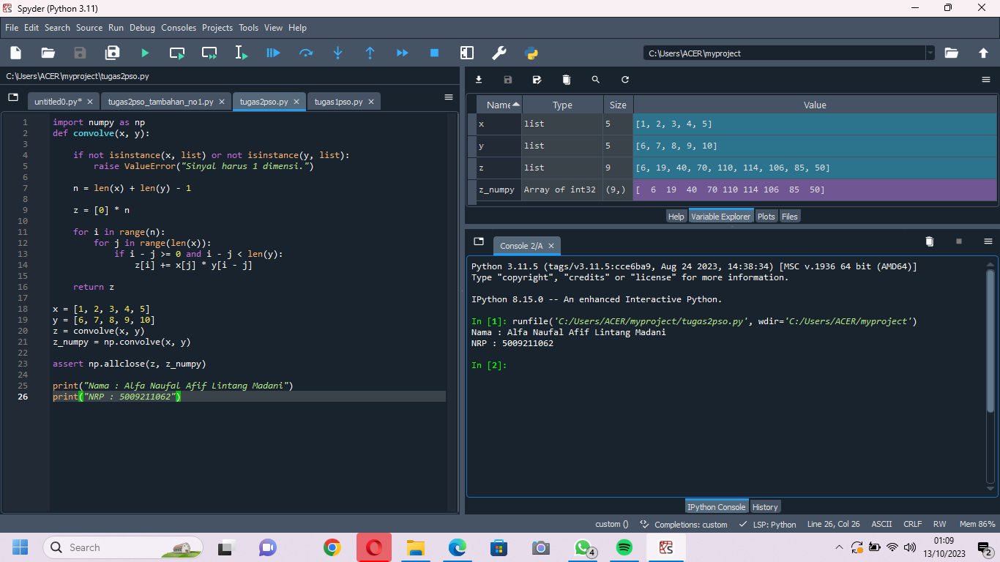
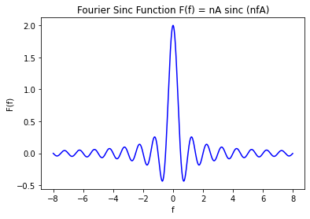
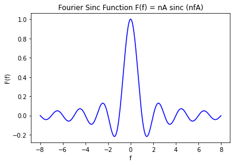
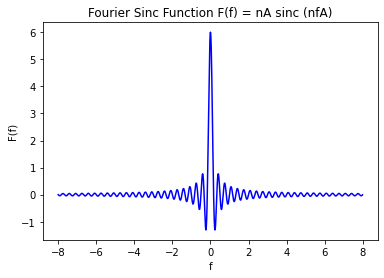

# Tugas 2 PSO
Terdapat dua tugas, yaitu tugas utama dan tugas tambahan yang diberikan oleh Pak Dhani ketika di kelas. 

## Tugas Utama
Tugas utama merupakan mengimplementasikan konvolusi dari dua sinyal 1 dimensi dengan ketentuan hanya menggunakan bahasa Python dasar dan tidak boleh menggunakan library apapun kecuali numpy untuk memvalidasi hasil konvolusi.
Berikut kode Python-nya:
```py
import numpy as np
def convolve(x, y):
   
    if not isinstance(x, list) or not isinstance(y, list):
        raise ValueError("Sinyal harus 1 dimensi.")

    n = len(x) + len(y) - 1

    z = [0] * n

    for i in range(n):
        for j in range(len(x)):
            if i - j >= 0 and i - j < len(y):
                z[i] += x[j] * y[i - j]

    return z

x = [1, 2, 3, 4, 5]
y = [6, 7, 8, 9, 10]
z = convolve(x, y)
z_numpy = np.convolve(x, y)

assert np.allclose(z, z_numpy)

print("Nama : Alfa Naufal Afif Lintang Madani")
print("NRP : 5009211062")
```
### Penjelasan 
- Pertama, program mengimpor modul numpy untuk melakukan operasi matematika dan pemrosesan array.
- Kedua, program mendefinisikan sebuah fungsi bernama convolve yang menerima dua parameter x dan y, yang merupakan dua sinyal 1 dimensi berupa list.
- Ketiga, fungsi tersebut melakukan beberapa hal:
    + Fungsi tersebut memeriksa apakah parameter x dan y adalah list. Jika tidak, fungsi tersebut akan mengeluarkan ValueError dengan pesan “Sinyal harus 1 dimensi.”
    + Fungsi tersebut menghitung panjang dari sinyal hasil konvolusi, yaitu n = len(x) + len(y) - 1.
    + Fungsi tersebut membuat sebuah list kosong berisi nol sepanjang n, yang akan diisi dengan nilai-nilai konvolusi.
    + Fungsi tersebut menggunakan loop bersarang untuk menggeser salah satu sinyal di atas yang lain dan menghitung jumlah produk pada setiap posisi.
    + Fungsi tersebut mengembalikan list yang berisi nilai-nilai konvolusi sebagai hasilnya.
- Keempat, program mendefinisikan dua sinyal 1 dimensi sebagai contoh, yaitu x = [1, 2, 3, 4, 5] dan y = [6, 7, 8, 9, 10].
- Kelima, program mencetak sinyal-sinyal tersebut.
- Keenam, program menghitung dan mencetak konvolusi antara x dan y menggunakan fungsi yang telah didefinisikan, yaitu z = convolve(x, y).
- Ketujuh, program menghitung dan mencetak konvolusi antara x dan y menggunakan fungsi bawaan dari modul numpy, yaitu z_numpy = np.convolve(x, y).
- Kedelapan, program memeriksa apakah hasil konvolusi dari kedua fungsi tersebut sama dengan menggunakan fungsi np.allclose(z, z_numpy). Jika sama, program akan mencetak “True”, jika tidak sama, program akan mencetak “False”.

### Screenshot


## Tugas Tambahan
Tugas tambahan ini ada dua nomor.
### Nomor 1
Membuat plot grafik dari fungsi sinc yang sudah dikerjakan secara manual menggunakan bahasa Python. Kode dapat dilihat di https://github.com/lavarrezel/tugas-sinyal-2/blob/main/tugas_tambahan/tugas2pso_tambahan_no1.py
- F(f) = 2A sinc (2fA)
   + Ubah nilai n menjadi 2 dan asumsikan nilai A adalah 1 seperti ini:
       ```py
     # Choose some values for n and A
      n = 2
      A = 1
      ```
   + Jalankan kode sehingga mendapatkan plot gambar seperti berikut:
     
- F(f) = A sinc (fA)
  + Ubah nilai n menjadi 1 dan asumsikan nilai A adalah 1 seperti ini:
       ```py
     # Choose some values for n and A
      n = 1
      A = 1
      ```
   + Jalankan kode sehingga mendapatkan plot gambar seperti berikut:
     
- F(f) = 6A sinc (6fA)
  + Ubah nilai n menjadi 6 dan asumsikan nilai A adalah 1 seperti ini:
       ```py
     # Choose some values for n and A
      n = 6
      A = 1
      ```
   + Jalankan kode sehingga mendapatkan plot gambar seperti berikut:
     
